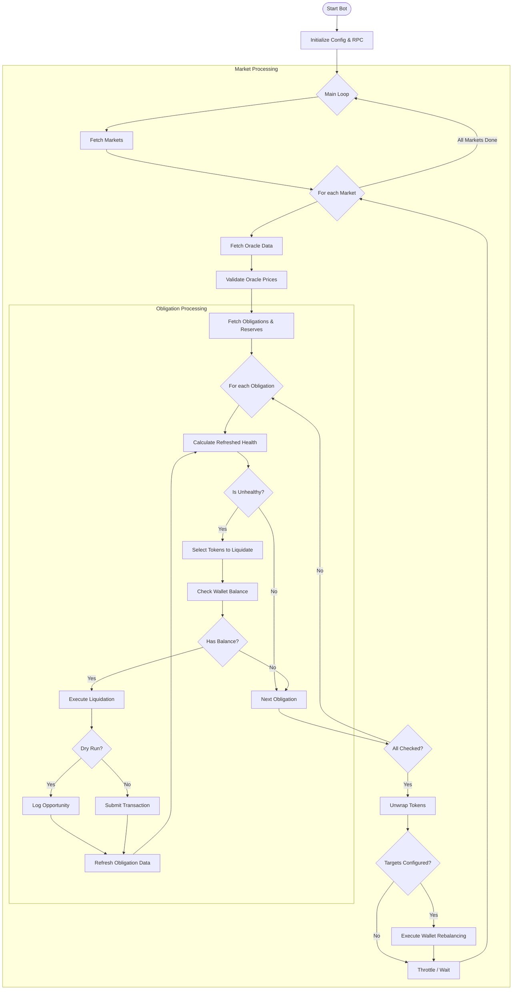

# Solend Liquidator Bot - Rust Edition

> ⚠️ **Note**: This is a Rust rewrite of the original Node.js liquidator bot. The original implementation has been moved to the archive.

## Quick Start

### 1. Install Rust
```bash
curl --proto '=https' --tlsv1.2 -sSf https://sh.rustup.rs | sh
```

### 2. Configure Environment
```bash
cp .env.example .env
# Edit .env with your RPC endpoint and wallet path
```

### 3. Build & Run
```bash
# Build release binary
cargo build --release

# Run liquidator
RUST_LOG=info ./target/release/liquidator

# Run in dry-run mode (safe testing, no transactions submitted)
RUST_LOG=info ./target/release/liquidator --dry-run
```

## Configuration

Create a `.env` file with the following variables:

```bash
# Required
APP=production                                    # or 'devnet' for testing
RPC_ENDPOINT=https://your-private-rpc-url        # Private RPC required
SECRET_PATH=/path/to/wallet.json                  # File system wallet

# Optional
MARKETS=4UpD2fh7xH3VP9QQaXtsS1YY3bxzWhtfpks7FatyKvdY  # Comma-separated market addresses
THROTTLE=1000                                     # Milliseconds between iterations

# Wallet Rebalancing (optional)
TARGETS=USDC:1000 SOL:5 USDT:500 ETH:0.5         # Token distribution targets
REBALANCE_PADDING=0.2                            # Tolerance (20% = 0.2)
```

## Features

### ✅ Implemented
- **Obligation Monitoring**: Continuously scans Solend markets for unhealthy obligations
- **Automated Liquidation**: Executes liquidations with optimal collateral/repay selection
- **Multi-Market Support**: Monitors all Solend markets or specific ones
- **Pyth Oracle Integration**: Fetches real-time prices for health calculations
- **Oracle Price Validation**: Validates prices for staleness and sanity
- **Dry-Run Mode**: Test liquidation detection without submitting transactions (`--dry-run` flag)
- **Wallet Rebalancing**: Automatic token distribution via Jupiter (configure with `TARGETS`)
- **Jupiter Swap Integration**: Efficient token swaps using Jupiter v6 API
- **Throttling**: Configurable rate limiting to avoid RPC throttling
- **Switchboard Support**: Basic Switchboard oracle support (Pyth recommended for production)

### 🚧 Partial Implementation
- **Token Unwrapping**: Framework in place, specific protocols need implementation

## Logic Flow



## Architecture

```
src/
├── main.rs                 # Main liquidation loop
├── config.rs               # Configuration management
├── rpc.rs                  # Solana RPC client wrapper
├── utils.rs                # Utilities and constants
├── models/                 # Data structures
│   ├── market.rs          # Market configuration
│   ├── obligation.rs      # Obligation account parsing
│   ├── reserve.rs         # Reserve account parsing
│   └── last_update.rs     # Slot tracking
├── oracle/                # Price oracle integration
│   ├── pyth.rs           # Pyth price feeds
│   └── switchboard.rs    # Switchboard (placeholder)
├── liquidation/          # Core liquidation logic
│   ├── refresh.rs        # Health calculation
│   ├── instructions.rs   # Solend instruction builders
│   └── execute.rs        # Transaction execution
└── wallet/               # Wallet management
    └── balance.rs        # Token balance queries
```

## Development

### Building
```bash
# Debug build (faster compilation)
cargo build

# Release build (optimized)
cargo build --release

# Run tests
cargo test
```

### Logging
Set `RUST_LOG` environment variable:
```bash
RUST_LOG=debug ./target/release/liquidator  # Verbose logging
RUST_LOG=info ./target/release/liquidator   # Normal logging
RUST_LOG=warn ./target/release/liquidator   # Minimal logging
```

### Dry-Run Mode
Test liquidation detection without submitting transactions:
```bash
# Safe testing - no transactions will be submitted
./target/release/liquidator --dry-run

# Combine with logging
RUST_LOG=info ./target/release/liquidator --dry-run
```

## Compared to Node.js Version

| Aspect | Node.js | Rust |
|--------|---------|------|
| **Binary Size** | N/A (interpreted) | ~15MB |
| **Startup Time** | Slower (JIT) | Fast (native) |
| **Memory Usage** | Higher | Lower (~50-70% reduction) |
| **Type Safety** | TypeScript | Rust (compile-time) |
| **Dependencies** | 48 npm packages | 35 crates |

## Wallet Setup

Fund your wallet with tokens for liquidation:

```bash
# Minimum recommended for main market:
# - 100 USDC (base token for most liquidations)
# - 0.5 SOL (for transaction fees)
# - Small amounts of other major tokens
```

The bot will attempt to liquidate using available wallet tokens. Without auto-rebalancing enabled, you'll need to manually swap tokens as they deplete.

## Troubleshooting

### "Failed to fetch markets"
- Check your internet connection
- Verify Solend API is accessible: https://api.solend.fi/v1/markets/configs

### "Failed to get obligations"
- Verify RPC endpoint is correct and accessible
- Ensure RPC provider allows `getProgramAccounts` calls
- Check RPC rate limits

### "Insufficient [TOKEN] to liquidate"
- Fund wallet with the required token
- Or wait for obligations that require tokens you have

### Build Errors
```bash
# Clean and rebuild
cargo clean
cargo build --release
```

## Safety

- **Test on Devnet First**: Set `APP=devnet` before mainnet
- **Start Small**: Begin with minimal wallet balance
- **Monitor Closely**: Watch logs for the first few liquidations
- **Private RPC**: Public RPCs will rate limit aggressively

## Support

For issues or questions:
1. Check logs with `RUST_LOG=debug`
2. Review the [walkthrough documentation](file:///Users/yorshka/.gemini/antigravity/brain/a238912c-f96d-47c9-85c4-879e74e0edec/walkthrough.md)
3. Consult [Solend documentation](https://docs.solend.fi/)

## License

ISC - Same as original Node.js implementation

---

**Original Node.js Implementation**: Archived - see git history or package.json for reference
